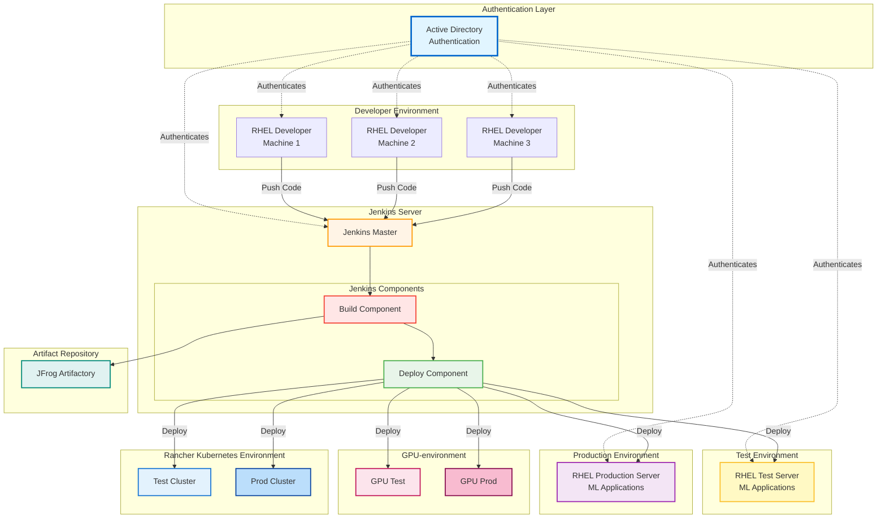
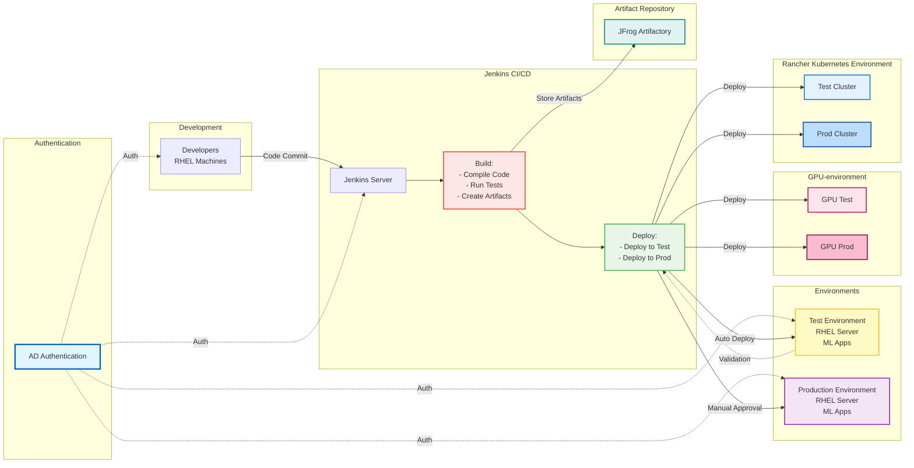
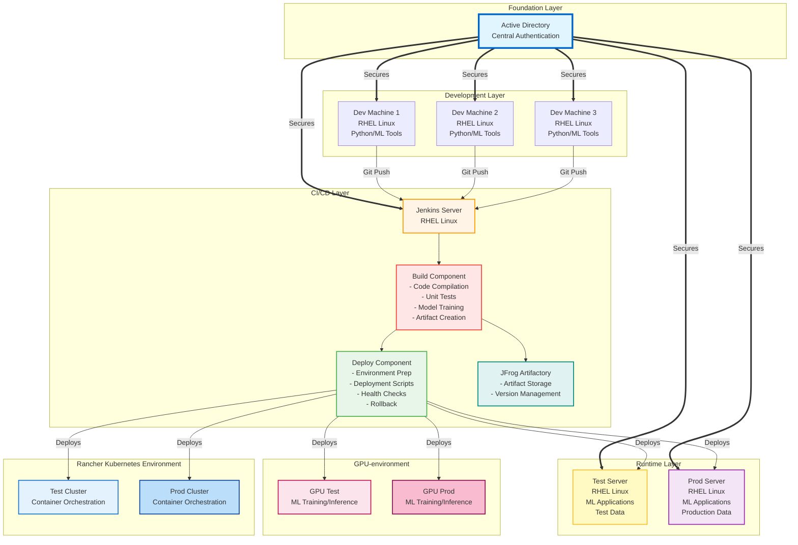
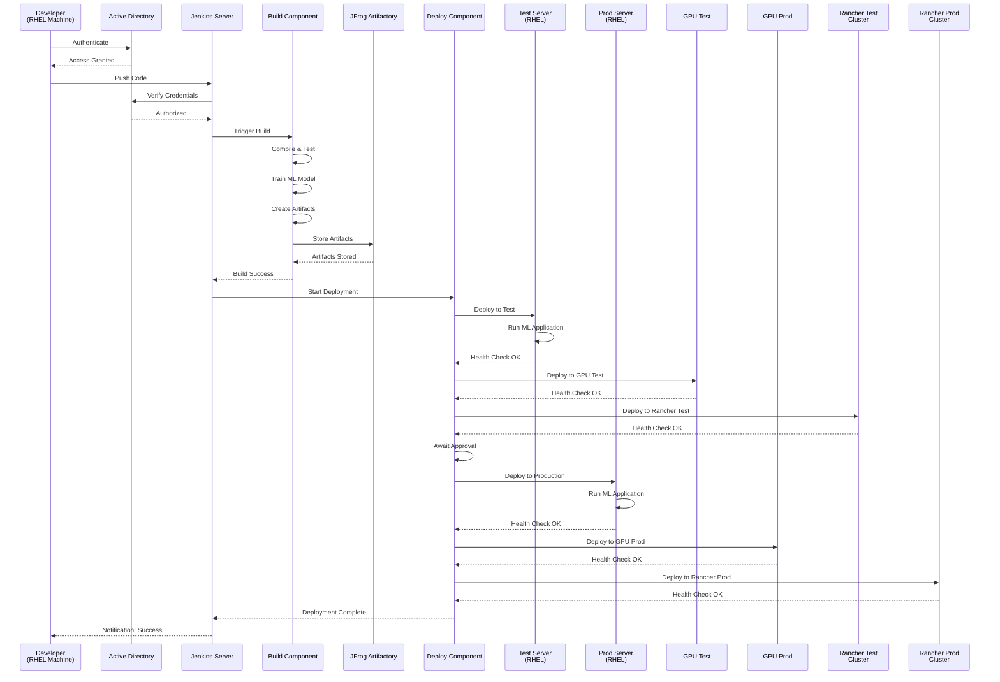

# MLOps Arkitektur

Indeholder Mermaid diagrammer på en eksempel MLOps stack template.

## MLOps Stack Architecture Overview

This diagram shows the complete MLOps infrastructure stack with RHEL-based servers, AD authentication, Jenkins CI/CD pipeline, and deployment environments.

## Detailed CI/CD Pipeline Flow

This diagram shows the detailed flow of the CI/CD pipeline from development to production.

## Component Architecture

This diagram shows the technical architecture of each component in the MLOps stack.

## Deployment Sequence

This sequence diagram shows the typical deployment flow from code commit to production.

## Infrastructure Components

### Developer Machines (RHEL)
- Red Hat Enterprise Linux workstations
- Development tools: Python, ML frameworks, Git
- Connected to AD for authentication

### Active Directory (AD)
- Central authentication and authorization
- Manages access to all infrastructure components
- Provides SSO capabilities across the MLOps stack

### Jenkins Server
- Orchestrates CI/CD pipeline
- **Build Component:**
  - Code compilation and validation
  - Unit and integration testing
  - ML model training and validation
  - Artifact packaging
  
- **Deploy Component:**
  - Environment provisioning
  - Application deployment
  - Configuration management
  - Health checks and monitoring

### Test Environment (RHEL)
- Pre-production testing server
- Runs ML applications with test data
- Validates deployments before production

### Production Environment (RHEL)
- Production ML application server
- Serves real-time ML predictions
- Monitored and maintained for high availability
